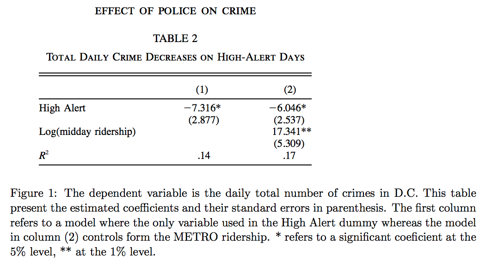

```{r setup, include=FALSE}
```
```{r Loading Libraries, echo=TRUE, message=FALSE, warning=FALSE, show=FALSE}

library(tidyverse)
library(mosaic)
library(ggplot2)
library(dplyr)
library(stringr)
library(modelr)
library(rsample)
library(caret)
library(parallel)
library(foreach)
library(knitr)
library(nnet)
library(ROCR)
library(gbm)
library(rpart)
library(randomForest)
library(ggmap)
library(scales)
```
```{Question 1, echo=TRUE}
## Why can’t I just get data from a few different cities and run the regression of “Crime” on “Police” to understand how more cops in the streets affect crime? (“Crime” refers to some measure of crime rate and “Police” measures the number of cops in a city.)
```
The relationship between crime and the number of police may not be causal.There are numerous confounding factors that could impact the crime rate. Furthermore, the number of cops may actually be a response to the previous crime rate. It is conceivable that crime precedes police.

```{Question 2, echo=TRUE}
## How were the researchers from UPenn able to isolate this effect? Briefly describe their approach and discuss their result in the “Table 2” below, from the researchers' paper.
```



The researchers were able to isolate the effect by factoring in the terror alert warning system. On days of "high alert", DC authorities were legally obligated to increase the police presence around the city. They could then observe variation in the crime rate controllig for significant changes in police presence by proxy.

```{Question 3, echo=TRUE}
## Why did they have to control for Metro ridership? What was that trying to capture?
```
There was the consideration that there were secondary effects of an increase in the terror alert level. Perhaps there would be fewer potential victims on the streets while there was a high alert. To control for this, they factored in metro ridership numbers, as such figures would be highly correlated to the number of potential victims out in public.

```{Question 4, echo=TRUE}
## Below I am showing you "Table 4" from the researchers' paper. Just focus on the first column of the table. Can you describe the model being estimated here? What is the conclusion?
```


This model is similar to the model in table 2, with a few changes. There is the addtion of a dummy variable which controls for the variation in a specfic police district(1), compared to the other districts. This could be important, if District 1 includes high priority areas such as the National Mall which would require an even greater police presence in response to an increase in the terror alert level. Another change is putting ridership in log form, so the partial effect can be interpreted relative to a percent change in ridership.We are asked to consider log-transformation of the dependent variable. Log transformation is useful in reducing the distribution of standard errors, or simplify the interpretation of the interaction terms. We do not find it particularly useful for either to log-transform the dependent variable.


# Problem 1
## CART
```{r Problem 1a, message=FALSE, warning=FALSE}
DEN <- read_csv("dengue.csv")

DEN$season = as.factor(DEN$season)
DEN$city = as.factor(DEN$city)

x = initial_split(DEN, prop = 0.8)
DEN_train = training(x)
DEN_test = testing(x)

cart_test = rpart(total_cases ~ season + avg_temp_k + precipitation_amt + city + specific_humidity, 
               data = DEN_train,
               control = rpart.control(cp=.000002))

plotcp(cart_test)
# cp = .02 seems reasonable
cttRMSE = modelr::rmse(cart_test,DEN_test)

rmse_frame_cart=foreach(x=1:10, .combine='rbind')%do%{
x = initial_split(DEN, prop = 0.8)
DEN_train = training(x)
DEN_test = testing(x)

cart = rpart(total_cases ~ season + avg_temp_k + precipitation_amt + city + specific_humidity, 
               data = DEN_train,
               control = rpart.control(cp=.02))
modelr::rmse(cart,DEN_test)
} %>% as.data.frame
validate_RMSE_cart = mean(rmse_frame_cart$V1) 
## 39.38
## Setting cp to .02 reduced RMSE by ~7%!

```

# Problem 1
## Random Forest
```{r Problem 1b, message=FALSE, warning=FALSE}

omit = na.omit(DEN)

rmse_frame_forest=foreach(x=1:10, .combine='rbind')%do%{
x = initial_split(omit, prop = 0.8)
omit_train = training(x)
omit_test = testing(x)


forest = randomForest(total_cases ~ season + avg_temp_k + precipitation_amt + city + specific_humidity, data = omit_train, importance = TRUE)
modelr::rmse(forest,DEN_test)
} %>% as.data.frame
validate_RMSE_forest = mean(rmse_frame_forest$V1) 
## 18.53

```

# Problem 1
## Gradient Boosted Trees
```{r Problem 1c, message=FALSE, warning=FALSE}
DEN <- read_csv("dengue.csv")

DEN$season = as.factor(DEN$season)
DEN$city = as.factor(DEN$city)


rmse_frame_boosty=foreach(x=1:10, .combine='rbind')%do%{

x = initial_split(DEN, prop = 0.8)
DEN_train = training(x)
DEN_test = testing(x)  

boosty = gbm(total_cases ~ season + avg_temp_k + precipitation_amt + city + specific_humidity, 
               data = DEN_train,
               interaction.depth=5, n.trees=500, shrinkage=.05)

modelr::rmse(boosty,DEN_test)
} %>% as.data.frame
validate_RMSE_boosty = mean(rmse_frame_boosty$V1) 
## 39.67

```

# Problem 1
## Partial Dependence Plots
```{r Problem 1d, message=FALSE, warning=FALSE}
omit_test = as.data.frame(omit_test)

partialPlot(forest, omit_test, 'specific_humidity')
partialPlot(forest, omit_test, 'precipitation_amt')
partialPlot(forest, omit_test, 'city')

```

# Problem 2 - Green Buildings Predictive Model Building
## Feature Engineering and Baseline Setting
```{r Problem 2a, message=FALSE, warning=FALSE}
GB <- read_csv("greenbuildings.csv")

# We want to collapse Energystar and LEED certifications into a two-level single variable.
# We define a "green building" as having either certification, or in the extreme, both certifications.
# This should provide higher fidelity than simply the "Green rating" variable.
GB = GB %>% mutate(green = (GB$Energystar + GB$LEED))
GB$green = as.factor(GB$green)

GB = GB %>% mutate(rpsf = (GB$Rent*GB$leasing_rate)) 

City_Market_Rent = scale(GB$City_Market_Rent)

rmse_frame_baseline=foreach(x=1:10, .combine='rbind')%do%{

x = initial_split(GB, prop = 0.8)
GB_train = training(x)
GB_test = testing(x)  

base =lm(rpsf ~size + empl_gr + stories + age + renovated + green + amenities + cd_total_07 + hd_total07 + City_Market_Rent, data = GB_train)

modelr::rmse(base,GB_test)
} %>% as.data.frame
validate_RMSE_base = mean(rmse_frame_baseline$V1) 
# Validated RMSE is 1036.5
```
We are tasked with answering a question for a building developer. Does green certification lead to increased revenue per square foot per calendar year? As both building to green standards and the certification process itself can be costly, it is of high importance to understand whether or not such investment will pay off. We begin with a dataset consisting of 7820 observations of 23 variables. We have to accomplish two things before we begin our analysis:

1) Conduct some feature engineering
2) Make a baseline model for comparison

First, we want to define our measure of "green". There are two binary indicators for whether or not a building is "Energystar" certified or "LEED" certified. As there is no significant difference between these certifications, and some buildings hold both certifications, we will collapse these two binary variables into one three-level variable, where "0" means no certifcation, "1" means one certification, and "2" means both certifications.By constructing the variable in such a way, we can assess whether or not having additional certifications is worth the investment.

Second, we need to construct our target variable, "revenue per square foot per calendar year", which is the product of "rent per square foot per calendar year" and "leasing rate". 

Lastly, we assume that the most significant variable, "city_market_rent", which is the average market rate of rent per square foot in the city the building is in. As this variable varies widely, and is likely of high importance, we standardize it for consistency.

For the baseline model, we run a simple linear regression on the variables we conject are of most importance. For greater reliability, we run 10 train test splits, and average the RMSE_out of each train/test split. This results in an RSME_out of 1036.5. Now we will move on to testing some more advanced modeling techniques against our baseline.

## Stepwise Selection
```{r Problem 2b, message=FALSE, warning=FALSE, include=FALSE, paged.print=FALSE}
baseline = lm(rpsf ~size + empl_gr + stories + age + renovated + green + amenities + cd_total_07 + hd_total07 + City_Market_Rent, data = GB_train)

lm_step = step(baseline,scope=~(.)^2)

rmse_frame_lm_step=foreach(x=1:10, .combine='rbind')%do%{

x = initial_split(GB, prop = 0.8)
GB_train = training(x)
GB_test = testing(x)  

modelr::rmse(lm_step,GB_test)
} %>% as.data.frame

validated_result_lm_step = mean(rmse_frame_lm_step$V1)
## Validated RMSE of 1002.35

summary(lm_step)

```

The first model we will try to test is a stepwise selected model utilizing the baseline model as a starting point. The stepwise selection will optimize against AIC, picking the features and interactions for us. Once the model is optimized against AIC, we run it through a 10 step cross-validation to get 10 instances of RMSE_out. We take the mean, and get a validated RMSE_out of 1002.35, which is roughly a 3% improvement. From the summary of the regression, we observe that a single green certification results in a 400 unit increase in rpsf, at a 99% confidence interval,ceteris paribus.There is no significant effect when we consider the second certification. While 3% in RMSE_out is a reasonable improvement it is likely we can have a more dramatic improvement using a random forest.


## Random Forest
```{r Problem 2c, message=FALSE, warning=FALSE}

omit = na.omit(GB)

rmse_frame_forest=foreach(x=1:10, .combine='rbind')%do%{
x = initial_split(omit, prop = 0.8)
omit_train = training(x)
omit_test = testing(x)


forest = randomForest(rpsf ~size + empl_gr + stories + age + renovated + green + City_Market_Rent, data = omit_train, importance = TRUE)
modelr::rmse(forest,omit_test)
} %>% as.data.frame
validate_RMSE_forest = mean(rmse_frame_forest$V1) 
## Validated RMSE of 780.26

```

When we run the random forest model,even on fewer covariates, we see an extremely dramatic improvement in our out of sample error. Similarly to the stepwise model and the baseline model, we run 10 train/test splits, and average the RMSE_out. Our validated RMSE_out for the random forest is 780.26, which is nearly a 25% improvement. Satisfied with this result, we will move on to the results.


## Random Forest- Results
```{r Problem 2d, message=FALSE, warning=FALSE}
vi = varImpPlot(forest, type=1)

omit_test = as.data.frame(omit_test)
partialPlot(forest, omit_test, 'City_Market_Rent')
partialPlot(forest, omit_test, 'age')
partialPlot(forest, omit_test, 'size')
partialPlot(forest, omit_test, 'green')

```

The variable importance plot demonstrates what we assumed from the beginning. The market rate of rent is by far the most important variable in the model in terms of MSE. At the bottom, we see that our green indicator is of very low importance. We can infer that green certification has a mild effect, and likely accounts for a small amount of the variable in rpsf.

Next, we make partial dependence plots of the three most important variables, and our target variable of interest, green. In the first plot, for city market rent, we observe a near linear relationship. As one expects, there is a steady positive relationship between rpsf, and the prevailing rent rates in the city.In the second plot, age, we observe a steady decline in rpsf as a building age increases. This makes sense, as older buildings are consistently less attractive to renters. For the size variable, we observe an interesting relationship, especially around where the majority of the distribution is. As building size increases, there is a dramatic rise in rpsf, the rate of which begins to decrease, which makes sense, when considering diminishing marginal returns on size at scale.

Lastly, our target variable, green; We observe that the first certification is related to roughly a 7-10% increase in rpsf. The addition of the second certification has almost no effect. If we take the evidence from the random forest model and the stepwise selected model together, I recommend that as long building to green certification standards costs less than ~5%, it is a safe investment in general, however, we could provide a far more reliable recomendation with more details. 

# Problem 3 -California Housing
## Feature Engineering and Graphing
```{r Problem 3a, message=FALSE, warning=FALSE}
CH <- read_csv("CAhousing.csv")

CH = CH %>% mutate(avg_rm = (CH$totalRooms/CH$households))
CH = CH %>% mutate(avg_bd = (CH$totalBedrooms/CH$households))
longitude = CH$longitude
latitude = CH$latitude
CH$medianHouseValue = scale(CH$medianHouseValue)
options(scipen=10000)

map = get_map(location = c(
  left = -124.936287,
  bottom = 31.679835,
  right = -113.447052,
  top = 43.000835))
mappy= ggmap(map)
mappy + geom_point(aes(x=longitude,y=latitude,color=medianHouseValue),data=CH,size=.5)+ggtitle("Median House Value")
```

We are tasked with creating a model for the median house value in different geographic regions in California. The first task we have is to do some feature engineering. Firstly, there is significant variation in median house value across the census tracts, so we will standardize, so results are reported in standard deviations from the mean. The data set is relatively flat, however, there are a few transformations that have to take place. We are given the total number of bedrooms in each census tract, and the total number of rooms in each census tract. By dividing the total number of each by the number of households, we have a reasonable approximation of the average number of bedrooms and rooms in each census tract.

For later comparison, we create a choropleth of the median housing value on the centroid of each census tract.

## Finding a strong model
```{r Problem 3b, message=FALSE, warning=FALSE, paged.print=FALSE}

baseline = lm(medianHouseValue ~ avg_rm + avg_bd + medianIncome + population,data=CH)
lm_step = step(baseline,scope=~(.)^2)
summary(lm_step)
resid = rstandard(lm_step)
pred = predict(lm_step)

```

For this problem, we face the constraint of a limited feature set. To get the most out of this data, it makes sense to lean on linear regression, and factor in as many interactions as reasonable. Hence, a stepwise selected model seems prudent. Running stepwise selection on all possible features, we are left with 5 added interactions, and statistical significance at the 99% level for all features. After the model is optimized against AIC, we extract predictions for median house value, and the residuals for graphing.


## Graphing Results
```{r Problem 3c, message=FALSE, warning=FALSE}

mappy + geom_point(aes(x=longitude,y=latitude,color=resid),data=CH,size=.5)+ggtitle("Residuals")
mappy + geom_point(aes(x=longitude,y=latitude,color=pred),data=CH,size=.5)+ggtitle("Predicted Median House Value")
```

For the graphed results, we see very flat outcomes. Both the predicted median house value and residual plots show limited variation. In the future, it would likely be wise to test more refined models, which would be enabled more greatly by more nuanced data availability.